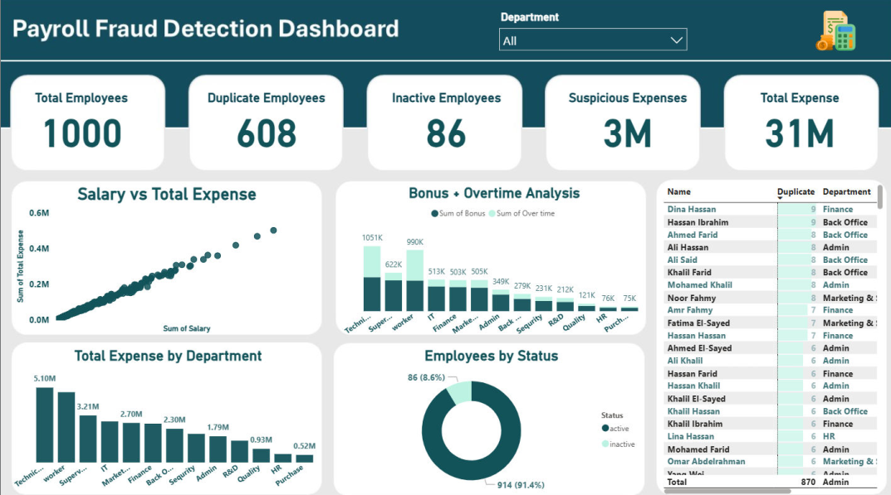

# Payroll Fraud Detection Dashboard

## Project Overview
This project analyzes HR and payroll data to detect potential financial manipulation and suspicious payroll activities within an organization.

The company suspected abnormal increases in payroll expenses and possible financial irregularities across departments. The objective of this analysis was to investigate employee records and identify anomalies such as duplicate employee records, ghost employees, and unusual expense patterns.

The analysis was performed using **Power BI** to transform insights into an interactive dashboard that supports financial monitoring and decision-making.

---

## Business Problem
Management noticed a continuous increase in payroll expenses without a clear explanation. This raised concerns about potential payroll manipulation such as:

- Duplicate employee records
- Payments made to inactive employees
- Inflated overtime or bonus payments

The goal of this project was to analyze HR data and identify suspicious financial patterns that may indicate payroll fraud.

---

## Dataset Description
The dataset contains HR and payroll information for **1000 employees**, including:

- Employee Name
- Department
- Employment Status (Active / Inactive)
- Years of Experience
- Base Salary
- Bonus
- Overtime
- Total Expense
- Performance Ratings (Efficiency, Innovation, Behavior)

The dataset was clean and well-structured, so the main focus of the analysis was detecting hidden financial anomalies rather than performing data cleaning.

---

## Key Findings

### Duplicate Employee Records
The analysis identified **608 duplicate employee names** within the system.  
This may indicate data entry issues or potential payroll inflation.

### Inactive Employees Receiving Payments
The analysis found **86 inactive employees** who were still receiving salary, bonuses, or overtime payments.  
This is a strong indicator of potential **Ghost Employees Fraud**.

### Suspicious Payroll Expenses
- Total payroll expenses reached **$31M**
- Approximately **$3M was flagged as suspicious expenses**

These records require further financial review.

### Department Expense Analysis
Certain departments showed unusually high payroll expenses, particularly in:

- Bonus allocations
- Overtime payments

This may indicate weak internal controls or manipulated payroll entries.

### Salary vs Total Expense Analysis
A comparison between **base salary and total expense** revealed several outliers where total expenses exceeded expected compensation levels.

These anomalies may indicate:
- Inflated overtime
- Unapproved bonuses
- Payroll irregularities

---

## Dashboard Features
The **Power BI Dashboard** provides clear visibility into payroll activity and highlights suspicious patterns using:

- Total Employees
- Duplicate Employees
- Inactive Employees
- Suspicious Expenses
- Total Payroll Expense
- Expense Distribution by Department
- Bonus and Overtime Analysis
- Salary vs Total Expense Outlier Detection

---

## Tools Used

- Power BI
- Data Analysis
- Financial Analysis
- Data Visualization

---

## Project Structure

'''
Payroll-Fraud-Detection-Analysis
│
├── Dashboard
│ └── Payroll Fraud Detection Dashboard.pbix
│
├── Dataset
│ └── HR Employee Dataset.xlsx
│
├── Presentation
│ └── Payroll Integrity Audit.pdf
│
├── Images
│ └── dashboard.png
│
└── README.md
'''
---

## Business Impact
This analysis helps organizations identify potential payroll fraud risks and suspicious financial patterns.

By detecting duplicate employees, inactive employee payments, and abnormal expense distributions, the dashboard enables management to:

- Detect payroll fraud
- Improve financial transparency
- Reduce financial leakage
- Strengthen internal controls

---

## Dashboard Preview

---

## Future Improvements

Potential improvements for this project include:

- Implementing automated fraud detection models
- Applying machine learning anomaly detection
- Building a multi-page financial investigation dashboard
- Integrating SQL pipelines for automated data updates

---

## Author

Mohamed Atif  
Junior Data Engineer | Data Analytics 
